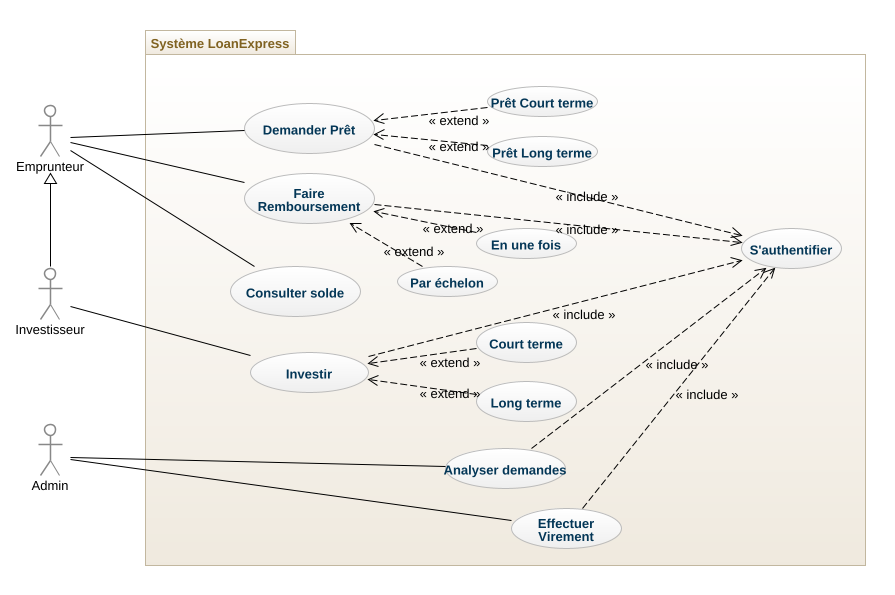
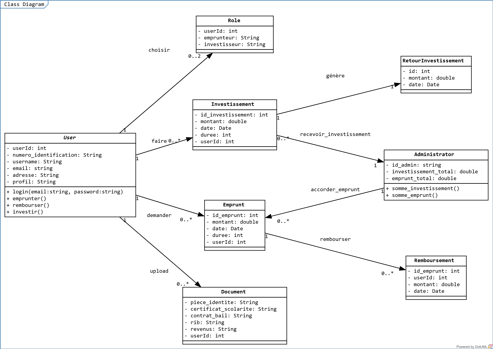
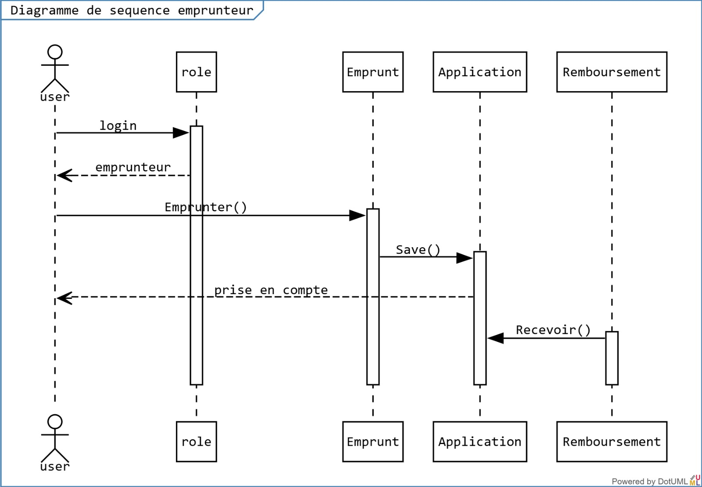
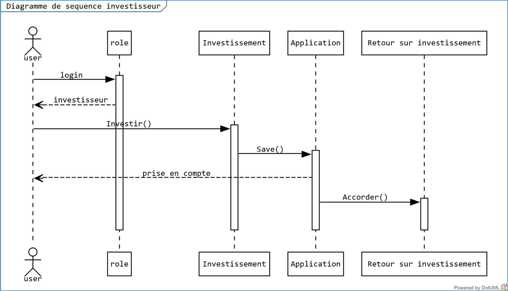
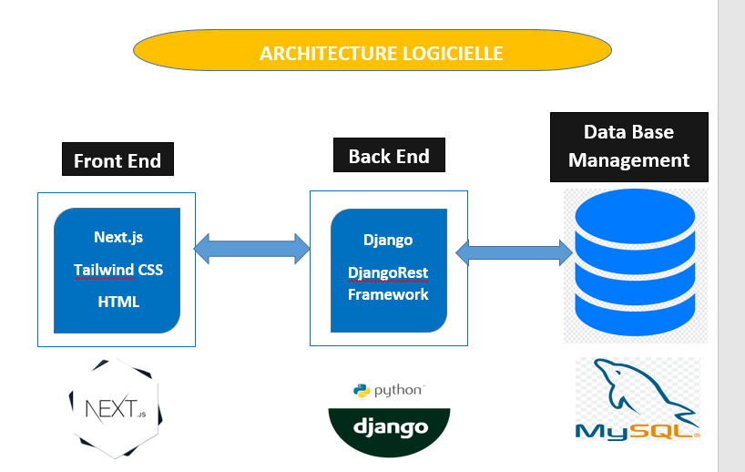

# Présentation technique de la plateforme LoanExpress

Ce document présente tous les aspects techniques de la plateforme LoanExpress. Nous présenterons les principaux diagrammes UML (Diagramme de Cas d’utilisation, Diagramme de Classe et le Diagramme de Séquence). Ensuite, l’API à implémenter et l’Architecture interne de la plateforme.

---

## Diagrammes UML

### Diagramme de Cas d’utilisation
Le diagramme de cas d’utilisation décrit de façon visuelle les fonctionnalités de base pour chaque type d’utilisation sur l’application.

- **Emprunteur** :  
  - Demander un prêt  
  - Faire un remboursement de prêt  
  - Consulter  

- **Investisseur** :  
  - Investir  
  - Peut également être emprunteur.  

- **Administrateur** :  
  - Analyser les demandes pour donner une réponse  
  - Effectuer des virements d’emprunt ou de remboursement à partir du fond commun de placement de la plateforme. 

---

### Diagramme de Classes
Le diagramme de classe définit la structure des différents objets regroupés en classes et les liens qui existent entre eux.

**Principales classes** :
- **User** : Regroupe tous les utilisateurs.  
- **Role** : Définit le rôle de chaque utilisateur (Emprunteur ou Investisseur). Un utilisateur peut avoir les deux rôles à la fois.  
- **Document** : Regroupe tous les documents des utilisateurs.  
- **Investissement** : Regroupe les investissements.  
- **Emprunt** : Regroupe les emprunts accordés.  
- **RetourInvestissement** : Regroupe les frais générés par investissement.  
- **Remboursement** : Regroupe les remboursements effectués par les emprunteurs.  
- **Administrator** : L’utilisateur qui administre la plateforme.  

---

### Diagramme de Séquence
Le diagramme de séquence donne une vue d’ensemble sur les enchaînements des scénarios d’utilisation de l’application.

#### Séquence d’utilisation (point de vue Emprunteur)

#### Séquence d’utilisation (point de vue Investisseur)

---

## Structure de l'API

L'API est construite autour des ressources principales suivantes :
- **Utilisateur** (`/users`)
- **Prêt** (`/loans`)
- **Investissement** (`/investments`)
- **Authentification** (`/auth`)

---

## Endpoints de l'API

### 1 – Gestion des Utilisateurs

| Méthode | Endpoint           | Description                                          |
|---------|--------------------|------------------------------------------------------|
| POST    | `/auth/register`   | Inscription d'un utilisateur (étudiant ou investisseur). |
| POST    | `/auth/login`      | Authentification et génération d'un token JWT.       |
| GET     | `/users`           | Liste tous les utilisateurs (admin uniquement).      |
| GET     | `/users/{id}`      | Récupère les informations d'un utilisateur par son ID. |
| DELETE  | `/users/{id}`      | Supprime un utilisateur (admin uniquement).          |
| PUT     | `/users/{id}`      | Met à jour les informations d'un utilisateur.        |

---

### 2 – Gestion des Prêts

| Méthode | Endpoint           | Description                                          |
|---------|--------------------|------------------------------------------------------|
| POST    | `/loans`           | Soumet une demande de prêt (étudiant).              |
| GET     | `/loans`           | Liste tous les prêts (admin ou investisseur).        |
| GET     | `/loans/{id}`      | Récupère les détails d'un prêt spécifique.           |
| PUT     | `/loans/{id}`      | Met à jour le statut d'un prêt (admin).              |
| DELETE  | `/loans/{id}`      | Supprime une demande de prêt (admin uniquement).     |

---

### 3 – Gestion des Investissements

| Méthode | Endpoint           | Description                                          |
|---------|--------------------|------------------------------------------------------|
| POST    | `/investments`     | Investit dans un prêt (investisseur).               |
| GET     | `/loans`           | Liste tous les investissements de l'utilisateur connecté. |
| GET     | `/loans/{id}`      | Récupère les détails d'un investissement spécifique. |
| DELETE  | `/loans/{id}`      | Annule un investissement (si autorisé).             |

---

### 4 – Gestion des Remboursements

| Méthode | Endpoint                | Description                                          |
|---------|-------------------------|------------------------------------------------------|
| POST    | `/loans/{id}/repay`     | Effectue un remboursement pour un prêt donné (étudiant). |
| GET     | `/loans/{id}/repayments`| Liste les remboursements effectués sur un prêt.      |

## Architecture Logicielle de LoanExpress

Nous présentons ici de façon synthétique, l'architecture sur laquelle repose notre plateforme.
- Front End: Next.js, Tailwind CSS et HTML
- Back End, API : Django et Django Rest Framework
- Data Base : MySQL data base

