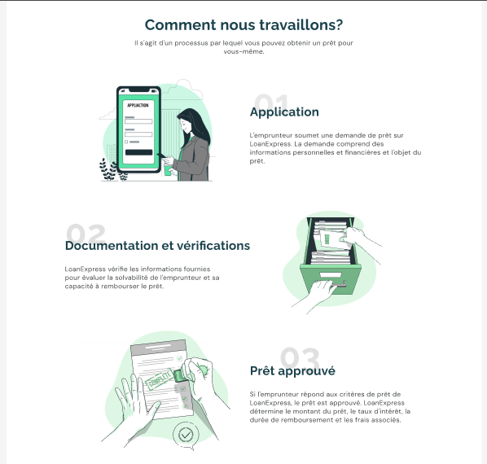
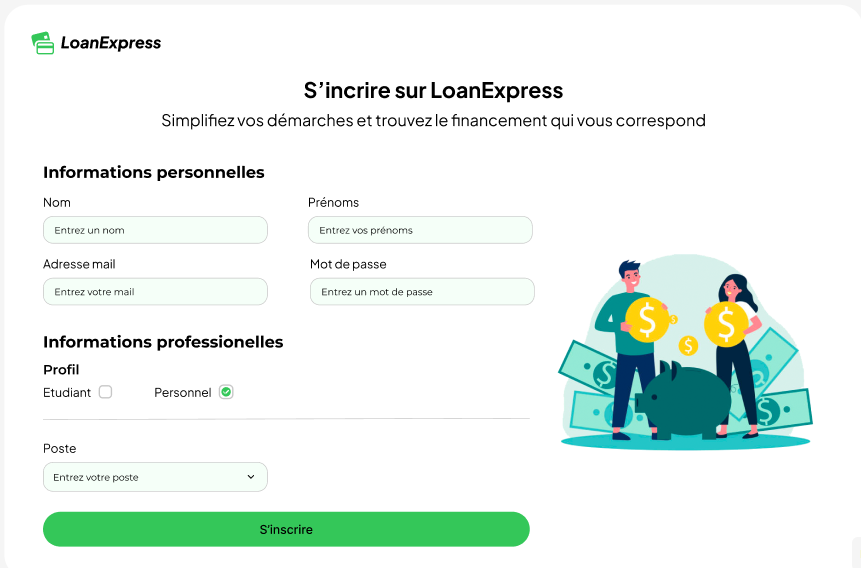
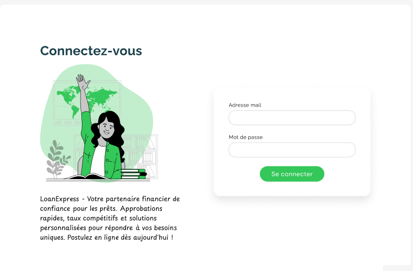
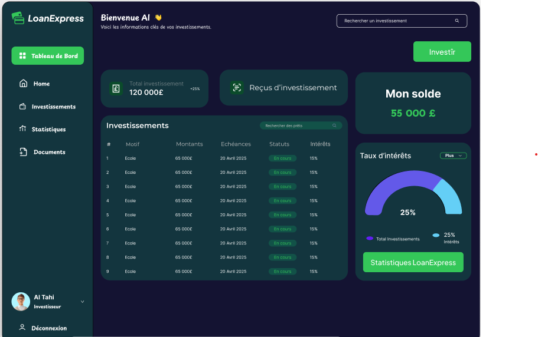
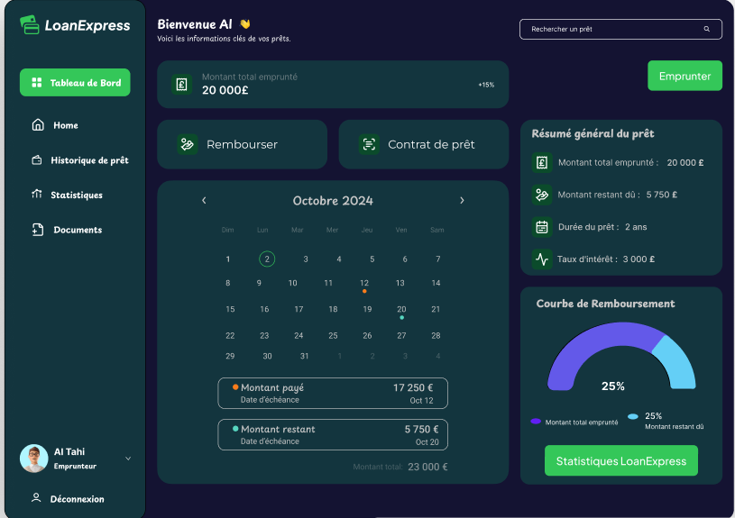
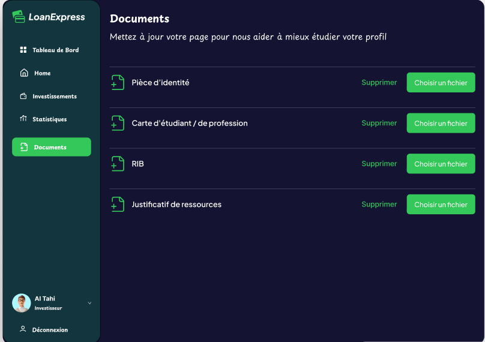
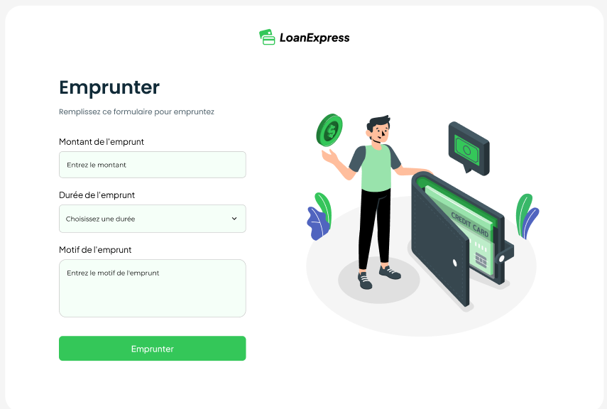
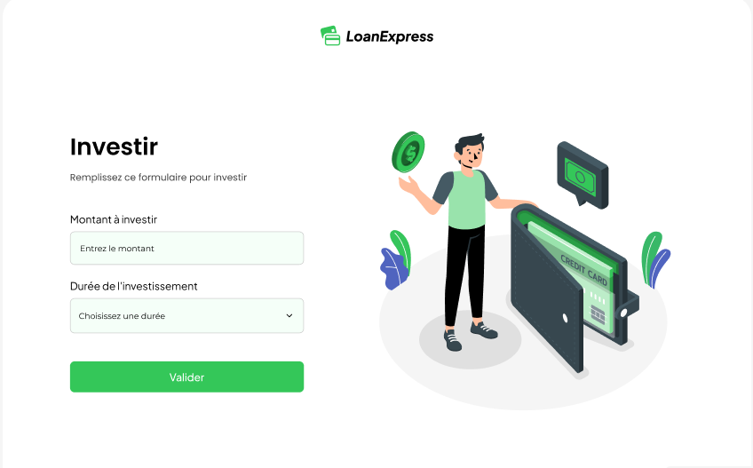

# Résumé Maquette

---

## 1- La page d’accueil

Le principal objectif de cette page est de fournir à l’utilisateur une vue d'ensemble complète de l’application, en lui donnant accès à toutes les informations essentielles. Elle sert de guide pour toute personne arrivant sur la plateforme LoanExpress.  
Les sections **« Nos services »** et **« Comment nous travaillons »** sont spécifiquement conçues pour répondre à ces besoins d'information.  

De plus, l’utilisateur peut facilement accéder à des fonctionnalités clés telles que :
- **Connexion**
- **Inscription** (permet aux nouveaux arrivants de s’enregistrer).  

Pour un utilisateur déjà inscrit, la connexion se fait en fonction de son profil : **emprunteur** ou **investisseur**.

---

## 2- La page d’inscription

L’inscription sur LoanExpress se fait en plusieurs étapes, selon le profil de l’utilisateur (emprunteur ou investisseur).

### a. Choix du profil
Dès l’arrivée sur la page d’inscription, l’utilisateur doit sélectionner son profil : **Emprunteur** ou **Investisseur**. Cette distinction permet de personnaliser l’expérience utilisateur.

### b. Informations personnelles
- Nom
- Prénom
- Adresse email
- Numéro de téléphone
- Mot de passe  

Ces données permettent de créer un compte sécurisé et d'assurer un contact avec LoanExpress.

### c. Détails spécifiques au profil
- **Pour l'emprunteur** :  
  Fournir des informations financières (situation professionnelle, formation, niveau d’étude, etc.).

- **Pour l'investisseur** :  
  Entrer des informations sur son profil d'investissement et son poste en tant que salarié.

---

## 3- La page de connexion

La page de connexion propose un accès classique :  
- L'utilisateur saisit son **adresse email** et son **mot de passe**.  
- Une fois authentifié, il est redirigé vers son tableau de bord personnalisé. 

---

## 4- Les tableaux de bord

### Dashboard Investisseur

Le tableau de bord investisseur inclut les fonctionnalités suivantes :

#### Entête
- Affiche le nom de l’utilisateur.
- Bouton **Investir** pour ajouter des fonds.
- Barre de recherche pour naviguer rapidement.

#### Menu latéral
- **Home** : Accès à la page principale du tableau de bord.
- **Investissement** : Informations sur les investissements (dates, montants, justificatifs, etc.).
- **Statistiques** : Évaluation des bénéfices potentiels.
- **Documents** : Gestionnaire de fichiers pour les documents téléchargés.
- **Profil utilisateur** : Informations personnelles.  
  - Si l’utilisateur a un compte emprunteur, il peut basculer entre les modes.
- **Déconnexion** : Quitter en toute sécurité.

#### Corps du dashboard
- **Total investissements** : Montant total investi.
- **Consultation des reçus** : Visualiser et télécharger les reçus.
- **Solde actuel** : Exemple : 55 000 €.
- **Tableau des investissements** : Suivi détaillé (motif, montant, échéances, gains).
- **Carte de statistiques d’investissement** : Taux d'intérêt et indicateurs clés.

---

### Dashboard Emprunter

Fonctionnalités similaires à celles du tableau de bord investisseur avec des spécificités :

#### Corps du tableau de bord
- **Montant total emprunté** : Exemple : 20 000 €.
- **Bouton Emprunter** : Soumettre une nouvelle demande de prêt.
- **Option de remboursement** : Effectuer des remboursements.
- **Contrat de prêt** : Documents officiels liés aux emprunts.
- **Échéancier des remboursements** : Dates, montants déjà remboursés et restants.
- **Résumé général du prêt** : Montant emprunté, restant dû, durée, taux d’intérêt.
- **Courbe de remboursement** : Graphique de l’évolution de la dette.

#### Menu latéral
- **Historique de prêt** : Remplace la section **Investissement**.

---

## 5- Les documents

Cette section contient l'ensemble des documents nécessaires à l’utilisateur pour effectuer un prêt ou un investissement (pièces renseignées lors de l’inscription).

---

## 6- Emprunter et Investir

### **Emprunter**
Pour demander un prêt, l’utilisateur doit remplir un formulaire avec :  
- Montant du prêt  
- Durée du prêt  
- Motif du prêt  

### **Investir**
Pour investir, l’utilisateur doit indiquer :  
- Montant à investir  
- Durée de récupération du capital avec intérêts  

---