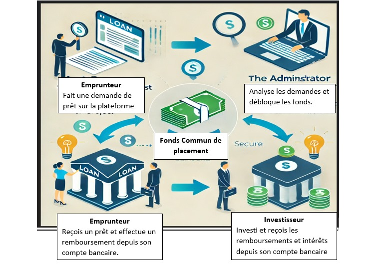

# Prêt En Ligne pour Étudiants Internationaux en France

## **Contexte du Projet**
Dans le cadre de notre formation de Master 1 MIAGE à l'ISTIC, nous avons une UE de Projet de Developpement Logiciel (PDL). Dans cette UE il est demander de proposer un projet de groupe de 5 étudiants, puis le développer avec les technologies de notre choix. Dans ce contexte, notre équipe à proposer de développer une application web pour les prêts étudiants dénommée : **LoanExpress**.  

---

### **Équipe**
#### **Équipe Backend**
- Fatoumata Thioro BAH
- Marro DIAGANA
- Yvann LOHOURY (**Chef de projet**)
#### **Équipe Frontend**
- Tiffany COULIBALY
- Oumou sadio BAH
- Fleur N'GUESSAN

---

## **Présentation**
Le projet consiste à créer une plateforme en ligne dédiée à l’octroi de prêts aux étudiants qui sont dans le besoin. 
Contrairement aux offres bancaires traditionnelles, notre service propose des prêts adaptés aux besoins spécifiques de ces étudiants, 
souvent confrontés à des difficultés pour accéder au financement en raison de l'absence de garanties locales ou d'historique de crédit.

---

## **Objectifs**
### **Objectif principal**
- Fournir un soutien financier accessible et adapté aux étudiants.
- Permettre à d'autres étudiants et professionnels de faire fructifier leur argent en finançant les prêts.

### **Objectifs spécifiques**
1. Offrir des prêts couvrant les frais de scolarité, de logement et de vie quotidienne.
2. Proposer des modalités de remboursement flexibles, adaptées à la durée des études et à la période d'intégration professionnelle.
3. Simplifier les démarches grâce à une plateforme digitale intuitive et rapide.
4. Permettre aux étudiants et professionnels d'épargner leur argent en l'investissant.
---

## **Fonctionnalités de la plateforme**
### **Fonctionnement**

### **Pour les étudiants (emprunteurs)**
- Création d’un profil utilisateur sécurisé.
- Simulation personnalisée du montant du prêt et des modalités de remboursement.
- Soumission des pièces justificatives (certificat de scolarité , pièce d'identité, etc.).
- Suivi en temps réel de l’état de la demande de prêt.

### **Pour les investisseurs (partenaires financiers)**
- Création d’un profil utilisateur sécurisé.
- Interface dédiée pour visualiser et financer des prêts.
- Gestion simplifiée des retours sur investissement.

### **Pour l'administrateur**
- Analyse et validation des demandes de prêts.
- Gestion du fond commun de placement de la plateforme.
- Décaissement des prêts approuvés et retour aux investisseurs.

---

## **Différenciation et Avantages**
### **Accessibilité sans garant**
- Évaluation basée sur le potentiel académique et professionnel, et non sur des garanties locales.

### **Remboursement différé**
- Aucune obligation de remboursement pendant les études, avec début des paiements après l’obtention d’un emploi.

### **Soutien personnalisé**
- Partenariats avec des universités et services de soutien pour garantir l’accompagnement des étudiants.

---

## **Public cible**
### **Cible principale**
- Étudiants  inscrits à l'Université de Rennes (On pourrait étendre à d'autres universités).

### **Profils typiques**
- Étudiants en licence,master, doctorat ou formations spécialisées.

---

## **Vision et Valeurs**
### **Vision**
- Faire de la plateforme le partenaire financier privilégié des étudiants  en France.

### **Valeurs**
- **Accessibilité** : Réduire les barrières financières pour les étudiants.
- **Innovation** : Tirer parti de la technologie pour simplifier les processus.
- **Confiance** : Établir des relations solides entre les universités et les investisseurs.

---

## **Développement du projet**
### **Étapes principales**
1. **Étude de faisabilité** :
   - Analyse du marché et des besoins spécifiques des étudiants.
   - Identification des acteurs clés (universités, organismes de soutien, investisseurs).

2. **Développement technique** :
   - Création d’une application web.
   - Intégration de fonctionnalités de simulation, de soumission et de suivi des prêts.

### **Technologies envisagées**
- **Backend** : Python (Django Framework).
- **Frontend** : React, Next.js,tailwind, Html, Css pour une interface utilisateur intuitive.
- **Système de Gestion de Base de données** : MySQL.
- **Versionning**: GitLab
-**Modélisation**: GenMyModel
-**API Test**: Postman
---

## **Plan financier**
### **Sources de revenus**
- Intérêts perçus sur les prêts octroyés.
- Commissions sur les investissements réalisés via la plateforme.

---

### **Compétences nécessaires**
-Connaissances en langage de programmation web, en modélisation(UML, Merise), en base de données.
- Gestion des risques financiers et évaluation de la solvabilité.
- Relation avec les universités et partenaires financiers.

---

## **Conclusion**
Le projet **"Prêt En Ligne pour Étudiants  en France"** vise à répondre à un besoin critique d'accessibilité financière pour les étudiants. 
En simplifiant le processus de demande de prêt, en s’appuyant sur des partenariats solides et en adoptant des pratiques innovantes, cette plateforme a le potentiel de transformer l’expérience des étudiants en France et de devenir un modèle pour d'autres pays.

---
